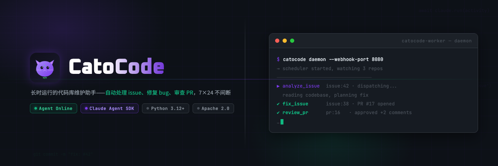

<div align="center">

<picture>
  
</picture>

<br />

<h3>Autonomous GitHub repository maintenance agent</h3>

<br />

[](https://github.com/humeo/cato-code/actions/workflows/ci.yml)
[](https://www.python.org/)
[](LICENSE)
[](https://www.docker.com/)

<br />

[Hosted Service](#hosted-service) · [Quick Start](#quick-start) · [See It Work](#see-it-work) · [Architecture](#architecture) · [Skills](#skills) · [CLI](#cli-reference) · [Contributing](#contributing)

</div>

---

> [!IMPORTANT]
> **Transparency notice:**
>
> - All code analysis runs inside isolated Docker containers on your infrastructure — no code leaves your machine except to the Anthropic API
> - CatoCode posts comments and opens PRs on your behalf, but **never merges without your explicit `/approve`**
> - Every action produces a verifiable evidence chain (before/after test results) — you can audit exactly what happened and why
>
> **To stop immediately:** `docker compose down`

---

## Why CatoCode

Maintaining a codebase is an ongoing commitment. Issues pile up, PRs wait for review, security vulnerabilities go unnoticed, and the backlog only grows when the team is focused on feature work.

Today's AI coding tools address part of the problem — but they all share the same limitation: **they stop working when you close the laptop.** Copilot and Cursor are powerful, but reactive — they wait inside your editor for you to ask.

CatoCode takes a different approach: **a long-running agent that stays beside your repository 24/7.** It watches for new issues and PRs, responds within seconds, and handles the repetitive maintenance loop autonomously — reproduce, analyze, fix, test, open PR. But unlike a black-box agent, every action is backed by a two-layer evidence chain: proof the bug exists before the fix, and proof the fix works after. You review a PR with a before/after evidence table and decide in 30 seconds whether to merge.

**Always running. Always proving. You stay in control.**

---

## Hosted Service

Don't want to self-host? Use the managed version:

**[www.catocode.com](https://www.catocode.com)** — Connect your GitHub repo, up and running in 5 minutes. No server configuration needed.

---

## Quick Start

```bash
git clone https://github.com/humeo/cato-code.git
cd cato-code
cp .env.example .env          # Add ANTHROPIC_API_KEY and GITHUB_TOKEN
docker compose up -d
docker compose exec catocode catocode watch https://github.com/owner/repo
```

Once running, CatoCode responds to new issues and PRs automatically. Full setup details in [Deployment](#deployment).

---

## See It Work

Issue opens → CatoCode pulls the code, reproduces the bug, posts a comment → you reply `/approve` → CatoCode fixes it, runs tests, opens a PR.

```
# 1. Watch a repo (runs continuously from here on)
$ docker compose exec catocode catocode watch https://github.com/alice/myproject
✓ Watching https://github.com/alice/myproject

# 2. Someone opens an issue:
#    "Bug: calculate_average() crashes when list is empty"

# 3. CatoCode pulls the code, reproduces the bug, and comments on the issue:
#
#    Reproduced.
#
#    Root cause: calculate_average() doesn't handle empty lists → ZeroDivisionError
#    Repro:  python -c "from stats import calculate_average; calculate_average([])"
#    Output: ZeroDivisionError: division by zero
#
#    Proposed fix: add an empty-list guard at the top, return 0 or None.
#    Reply /approve to proceed.

# 4. You reply: /approve

# 5. CatoCode fixes, runs tests, opens a PR with a full evidence table:
#
#    ## Evidence
#    | Check            | Before                   | After        |
#    |------------------|--------------------------|--------------|
#    | Repro command    | ❌ ZeroDivisionError      | ✅ Returns 0  |
#    | Full test suite  | 11 passed, 1 failed      | 12 passed    |

$ docker compose exec catocode catocode status
done  88b7ce3b  fix_issue  issue:42  $0.68
```

You review a PR with full evidence attached. 30 seconds to verify — no local test run needed.

---

## Architecture

### Design Principles

**Best harness, best model.** CatoCode uses the Claude Agent SDK to drive Claude Code CLI inside a container with a full dev toolchain (git, gh, python, node, uv). The agent reads code, writes code, runs tests, commits, and opens PRs — the same workflow as a real developer, not a thin API wrapper.

**Security first, system-level isolation.** Every task runs in an isolated Docker container — resource-limited, no host filesystem access. In SaaS mode, each user gets an independent container with dedicated named volumes.

**Skills over features.** Each capability is a standalone Markdown prompt template in `skills/`. Want to add a new capability? Write a `SKILL.md` — no Python changes required. The system scales by adding Skills, not by accumulating features.

**Proof of Work.** Every fix requires: failure evidence before + passing evidence after + full test suite with no regressions. The PR description contains a verifiable before/after table. You can decide in 30 seconds whether to merge.

### System Overview

```
┌─ Host Process ──────────────────────────────────────────────────┐
│                                                                  │
│  ┌─ Scheduler ─────────────────────────────────────────────┐    │
│  │  Approval Loop (30s)  — poll issue comments for /approve │    │
│  │  Patrol Loop (3600s)  — scan repos for new vulnerabilities│   │
│  │  Dispatch Loop (5s)   — pick pending → execute in container│  │
│  │                                                          │    │
│  │  Concurrency: per-repo asyncio.Lock + global Semaphore   │    │
│  └──────────────────────────────────────────────────────────┘    │
│                                                                  │
│  ┌─ Webhook Server ────────┐  ┌─ Decision Engine ───────────┐   │
│  │  /webhook/github/{repo} │→ │  Event → Skill routing      │   │
│  │  /webhook/app (App-lvl) │  │  Bot loop prevention        │   │
│  │  HMAC-SHA256 verify     │  │  Deduplication (delivery ID) │   │
│  └─────────────────────────┘  └─────────────────────────────┘   │
│                                                                  │
│  ┌─ Dispatcher ────────────────────────────────────────────┐    │
│  │  Skill prompt rendering (Markdown + variable substitution)│   │
│  │  Dual-layer timeout (10min idle + 2hr hard)              │    │
│  │  3x retry with repo reset between attempts               │    │
│  │  JSONL log streaming → DB (real-time cost tracking)      │    │
│  │  Session resume for multi-turn activities                │    │
│  └──────────────────────────────────────────────────────────┘   │
│                                                                  │
│  ┌─ API (SaaS mode) ──────┐  ┌─ Store ─────────────────────┐   │
│  │  OAuth 2.0 + Sessions   │  │  SQLite / PostgreSQL        │   │
│  │  20+ REST endpoints     │  │  12 tables, 15 migrations   │   │
│  │  SSE log streaming      │  │  Ownership-scoped queries   │   │
│  │  Patrol management      │  │  Rolling-window budgets     │   │
│  └─────────────────────────┘  └─────────────────────────────┘   │
│                                                                  │
└──────────────────────────┬──────────────────────────────────────┘
                           │ Docker API
┌─ Worker Container (per-user in SaaS) ──────────────────────────┐
│  catocode-worker[-{user_id}]                                    │
│  ├── Claude Agent SDK (bypassPermissions, fully autonomous)     │
│  ├── Dev tools: git, gh, python, node, uv, playwright           │
│  ├── /repos/{owner-repo}/ (shallow clone, reset per activity)   │
│  └── Named volumes (repos + agent memory persist across tasks)  │
└─────────────────────────────────────────────────────────────────┘
```

## Skills

Skills are Markdown prompt templates in `src/catocode/container/skills/`. Edit them directly — no code changes needed.

| Skill            | Trigger           | Behavior                                                                                                   |
| ---------------- | ----------------- | ---------------------------------------------------------------------------------------------------------- |
| `analyze_issue`  | Issue opened      | Pull code, reproduce, analyze root cause, check for duplicates via RAG, post comment, wait for `/approve`  |
| `fix_issue`      | After `/approve`  | Reproduce (Layer 1) → fix → verify (Layer 2) → open PR with before/after evidence table                    |
| `review_pr`      | PR opened         | Review code quality, security, test coverage, post structured review                                       |
| `respond_review` | PR review comment | Resume session, address feedback, push new commits (never force-push)                                      |
| `triage`         | Issue opened      | Classify (bug/feature/question/duplicate), attempt quick reproduction, apply labels                        |
| `patrol`         | Scheduled         | Proactively scan changed files for security/bugs, file issues with evidence, respect rolling-window budget |

### Proof of Work Protocol

The `fix_issue` skill enforces a two-layer evidence protocol:

**Layer 1 — Reproduction evidence (before fixing)**

```bash
# Prove the bug exists before touching any code
pytest tests/test_foo.py::test_bar 2>&1 | tee /tmp/evidence-before.txt
```

If the bug cannot be reproduced, no fix is attempted — CatoCode comments on the issue explaining why.

**Layer 2 — Verification evidence (after fixing)**

```bash
# Prove the fix works with the same reproduction steps
pytest tests/test_foo.py::test_bar 2>&1 | tee /tmp/evidence-after.txt
# Prove no regressions across the full test suite
pytest 2>&1 | tee /tmp/test-suite-after.txt
```

Every PR includes a before/after comparison table. Verify in 30 seconds without running tests locally.

### Human-in-the-Loop Approval

CatoCode never merges code autonomously. The approval flow ensures human oversight at the critical decision point:

```
Issue opened → analyze_issue (autonomous)
                    ↓
            Posts analysis + proposed fix
            "Reply /approve to proceed"
                    ↓
            Human reviews, replies /approve
                    ↓
            fix_issue (autonomous)
                    ↓
            Opens PR with evidence → Human merges
```

### Issue Deduplication (RAG Pipeline)

Before filing a new issue (patrol) or analyzing one (analyze_issue), CatoCode checks for duplicates:

1. **Stage 1 — Vector recall**: Generate embedding for the new issue, cosine-similarity search against indexed open issues (top-5 candidates)
2. **Stage 2 — LLM judgment**: Claude Haiku classifies each candidate as `duplicate`, `related`, or `unrelated`
3. **Fallback**: If embedding service is unavailable, keyword overlap coefficient (`|A∩B| / min(|A|, |B|)`) provides degraded but functional matching

---

## Deployment

Docker Compose is the recommended approach — no local Python or uv required.

### 1. Configure

```bash
git clone https://github.com/humeo/cato-code.git
cd cato-code
cp .env.example .env
```

Edit `.env`:

| Variable            | Required | Description                                         |
| ------------------- | -------- | --------------------------------------------------- |
| `ANTHROPIC_API_KEY` | Yes      | Anthropic API key                                   |
| `GITHUB_TOKEN`      | Yes      | GitHub PAT with `repo` scope                        |
| `PORT`              |          | Service port (default: `8000`)                      |
| `GIT_USER_NAME`     |          | Commit author name (default: `CatoCode`)            |
| `GIT_USER_EMAIL`    |          | Commit author email (default: `catocode@bot.local`) |
| `MAX_CONCURRENT`    |          | Max concurrent tasks (default: `3`)                 |
| `CATOCODE_MEM`      |          | Worker container memory limit (default: `8g`)       |
| `CATOCODE_CPUS`     |          | Worker container CPU limit (default: `4`)           |

Full variable list: [`.env.example`](.env.example)

### 2. Start

```bash
docker compose up -d
```

First run builds Docker images (~5-10 min). Subsequent starts use the cache. The service runs continuously and processes events automatically.

### 3. Watch a Repo

```bash
docker compose exec catocode catocode watch https://github.com/owner/repo
```

Multiple repos are supported — each is managed independently with per-repo serial execution.

### 4. Dashboard

The dashboard starts automatically with `docker compose up -d`. Open [http://localhost:3000](http://localhost:3000).

Features: real-time activity feed (5s polling), live log streaming (SSE), patrol configuration, cost tracking.

> To point at a remote backend, set `NEXT_PUBLIC_API_URL=http://your-server:8000` in `.env`, then run `docker compose up -d --build frontend`.

### 5. Webhooks (recommended)

Without webhooks, CatoCode uses scheduled patrol scans. Webhooks cut response latency from minutes to seconds.

```bash
# Create a public tunnel (macOS)
brew install cloudflare/cloudflare/cloudflared
cloudflared tunnel --url http://localhost:8000
```

In GitHub repo **Settings → Webhooks**, add:

- **URL**: `https://<tunnel-id>.trycloudflare.com/webhook/github/{owner-repo}`
- **Content type**: `application/json`
- **Events**: Issues, Issue comments, Pull requests, Pull request reviews

> `{owner-repo}` uses hyphen format, e.g. `alice-myproject`

---

## CLI Reference

```bash
# Watch a repo (register and start continuous monitoring)
catocode watch https://github.com/owner/repo

# Stop watching
catocode unwatch https://github.com/owner/repo

# Fix an issue immediately (blocking, streams logs in real time)
catocode fix https://github.com/owner/repo/issues/42

# View watched repos and recent activity
catocode status

# View activity logs (supports 8-char short ID)
catocode logs <activity_id>
catocode logs <activity_id> --follow   # Stream in real time

# SaaS mode: unified server with OAuth + API + webhooks
catocode server --port 8000

# CLI mode: scheduler + optional webhook server
catocode daemon --webhook-port 8080
```

> **With Docker Compose:** prefix commands with `docker compose exec catocode`.
> **Local development:** use `uv run catocode`.

---

## Tech Stack

| Layer                   | Technology                                                           |
| ----------------------- | -------------------------------------------------------------------- |
| Agent runtime           | Claude Agent SDK, Claude Code CLI                                    |
| Backend                 | Python 3.12, FastAPI, asyncio, uvicorn                               |
| Container orchestration | Docker SDK (Python), per-user named volumes                          |
| Database                | SQLite (dev) / PostgreSQL (prod), dual-backend abstraction           |
| Authentication          | GitHub App (JWT + installation tokens), OAuth 2.0, Fernet encryption |
| Frontend                | Next.js 15, React 19, TypeScript, Tailwind CSS 4                     |
| Embeddings              | OpenAI-compatible API, cosine similarity (pure Python)               |
| Package management      | uv (Python), bun (JS/TS)                                             |

---

## Development

```bash
uv sync --dev                            # Install dependencies
uv run pytest                            # Run unit tests
uv run pytest --cov=src/catocode         # With coverage
uv run pytest -m integration             # Integration tests (requires Docker)
uv run pytest -m e2e                     # End-to-end (requires Docker + GITHUB_TOKEN)
uv run ruff check src/ --fix             # Lint + auto-fix
cd frontend && bun install && bun dev    # Frontend dev server
```

### Project Structure

```
src/catocode/
├── cli.py                 # Entry point — 7 subcommands
├── scheduler.py           # 3 async loops, concurrency control
├── dispatcher.py          # Activity execution pipeline, timeouts, retries
├── skill_renderer.py      # Markdown template → prompt builder
├── store.py               # 12 tables, 55+ data methods
├── db.py                  # SQLite/PostgreSQL dual-backend abstraction
├── auth/                  # GitHub App + PAT factory pattern
├── api/                   # FastAPI routes, OAuth, session management
├── webhook/               # Event ingestion, HMAC verification, dedup
├── decision/              # Event → skill routing, admin permission checks
├── container/             # Docker lifecycle, SDK runner, skill templates
│   ├── manager.py         # Container 4-state machine
│   ├── scripts/           # run_activity.py (executes inside container)
│   └── skills/            # 6 Markdown skill templates
├── github/                # Issue fetcher, commenter, poller, permissions
├── templates/             # Prompt generators, agent identity rules
├── embeddings.py          # Embedding generation + summarization
└── issue_indexer.py       # RAG indexing + two-stage deduplication

frontend/                  # Next.js 15 dashboard
├── src/app/               # Pages (landing, dashboard, activity detail)
├── src/components/        # UI (live dashboard, log viewer, patrol panel)
└── src/lib/               # API client, TypeScript types
```

---

## Contributing

1. Fork the repo
2. Create a feature branch: `git checkout -b feature/amazing-feature`
3. Add tests and verify: `uv run pytest`
4. Commit: `git commit -m "feat: add amazing feature"`
5. Open a PR

---

## License

Apache License 2.0 — see [LICENSE](LICENSE).

---

<div align="center">

[Hosted Service](https://www.catocode.com) · [Quick Start](#quick-start) · [Architecture](#architecture) · [CLI Reference](#cli-reference) · [Contributing](#contributing)

</div>
